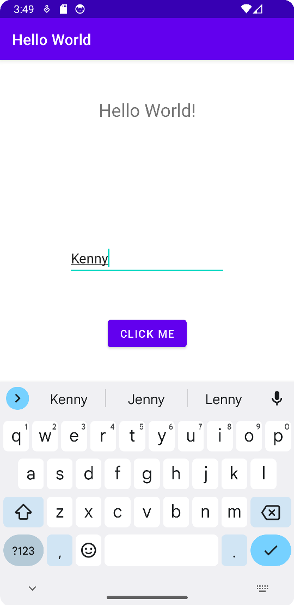

# Hello World Lab

## Description 

This application allows the user to enter text into the EditText view and store the value of that text to the TextView in the layout by pressing the button view. The button view has an event listener that sets the text value of the TextView to include the text value of the EditText view. 

The text entered in the EditText view can be updated and set in the TextView any number of times while the application is active by pressing the button view and activating the event listener.

## Screenshots

### Before button view is pushed

### After button view is pushed

